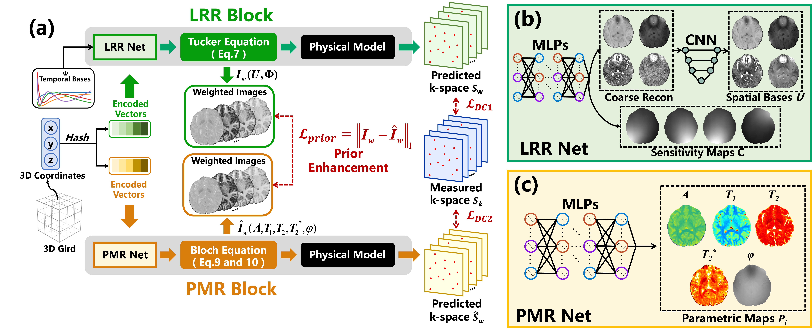
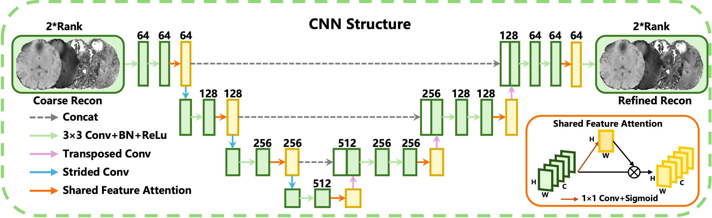

# LoREIN
This is the official code for “Unsupervised Highly Accelerated 3D Multi-Parametric MRI Reconstruction via Low-Rank Integrated Implicit Neural Representation”

   
  Fig. 1: Overview of the proposed LoREIN framework.

## 1. Environmental Requirements
### Some dependencies are essential:
- Python 3.10.X  
- PyTorch 2.0.0
- [tiny-cuda-nn](https://github.com/NVlabs/tiny-cuda-nn) ***(Important for neural implicit representation with a multiresolution hash encoding)***
- torchvision, h5py, numpy, scipy, other dependencies

## 2. Network Architecture
### 2.1 CNN in LRR-Net
Detailed implementation of the CNN architecture can be found in the [unet](/Network/unet) directory.

   
  Fig. 2: Pipeline of CNN in the LRR Net

### 2.2 Hash Encoders and MLPs
Specific configurations for the hash encoders and Multi-Layer Perceptrons (MLPs) are provided in [config_INR.yml](/Network/config_INR.yml)

## 3. Data
### 3.1 Public Data (vFA-EPTI) 
- Raw k-space data can be downloaded at:
[Download here](https://figshare.com/articles/dataset/VFA-EPTI_Datasets/13211669),

### 3.2 *In Vivo* Data (SUMMIT) 
Due to privacy concerns and compliance requirements, the *in vivo* datasets are temporarily restricted and cannot be shared at this stage. We appreciate your understanding. 

## 4. Future Work
More details and data will be made publicly available after the paper is officially accepted. 😇
